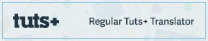

Traduções (por Erick Patrick)
==============

> Alguns posts do site Tut+, aqui traduzidos, em breve farão parte do site oficial do Tut+. Uma vez que elas estiverem no ar, as traduções daqui apontarão, diretamente, para o site oficial. Agradeço a compreensão.

Nesse repositório você encontrará várias traduções de material para desenvolvimento web. Não terá um foco, como só JavaScript, PHP, ou Experiência do Usuário. Porém, você poderá perceber que, em certas épocas, haverá mais traduções de um conteúdo que d'outros, uma vez que essas traduções acompanharão meus estudos no dia-a-dia.

O meu objetivo é trazer, pelo menos, 1 tradução por dia. Seja de um post pequeno ou grande, mas que traga 1 post. Algumas vezes, porém, compensarei alguns possíveis dias antecipadamente ou posteriormente, já que não sabemos o que pode ocorrer no futuro, certo?

Espero que estejam preparados e, quaisquer erros que encontrarem, podem abrir uma *issue* que a corrigirei com prazer e assim que possível.

Embora a maioria das traduções estejam voltadas para artigos, vocês poderão ver traduções de livros e documentações de projetos *open source*, também.

Traduções Realizadas
--------------------
Cada uma das pastas contém (ou conterá) uma lista com o link para cada um dos posts traduzidos, organizados por nível de conhecimento (básico, básico-intermediário, intermediário, intermediário-avançado, avançado, avançado-profissional, profissional)

Futuras Traduções
-----------------
Cada uma das pastas contém (ou conterá) uma lista com os futuros posts que serão traduzidos, organizados por nível de conhecimento. É provável que será seguida a ordem em que são listados.